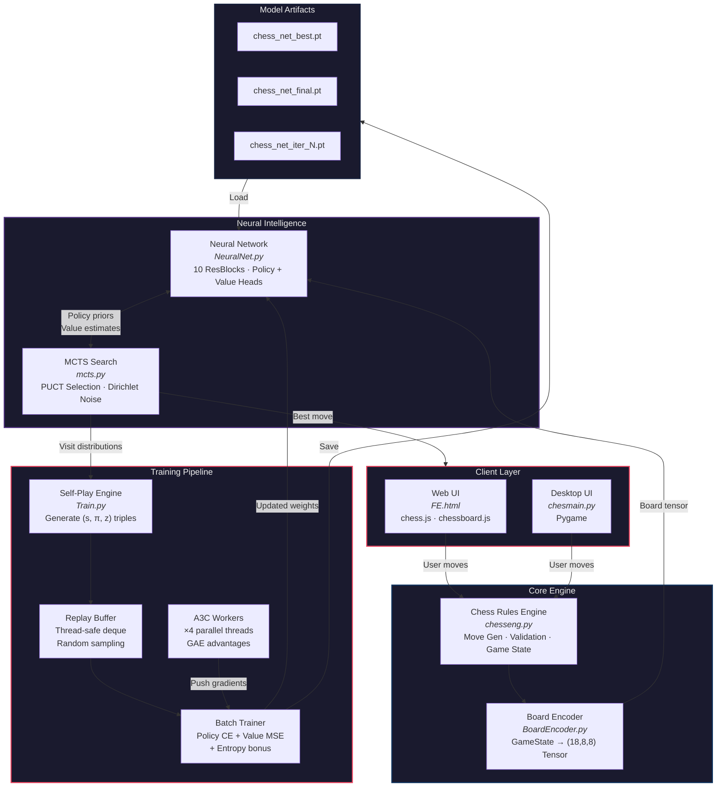
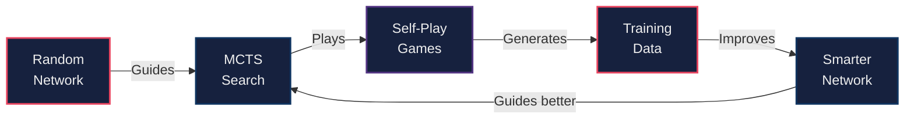
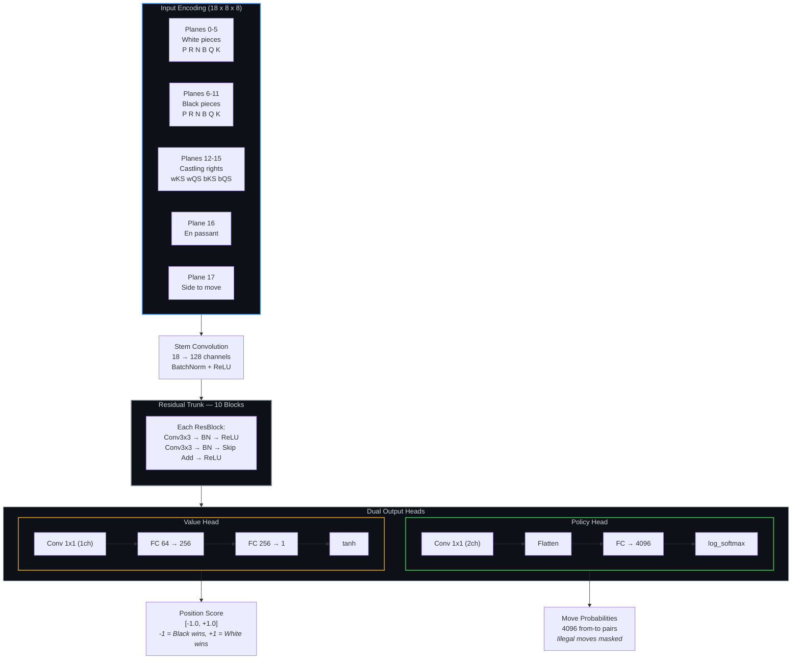
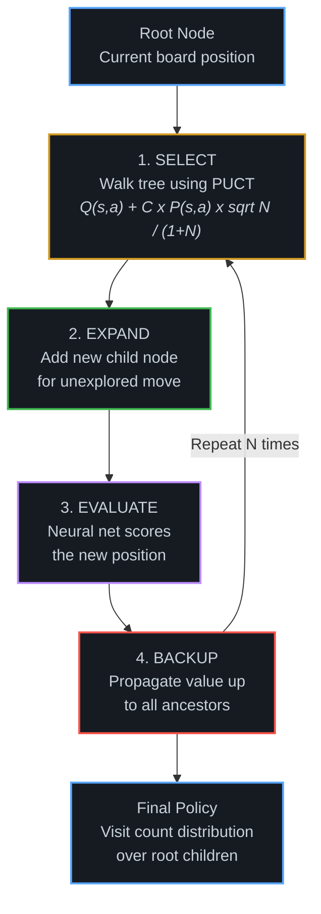
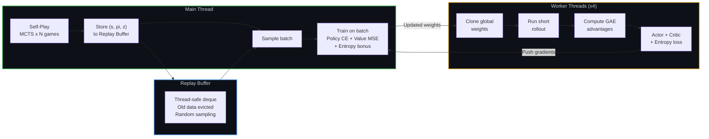
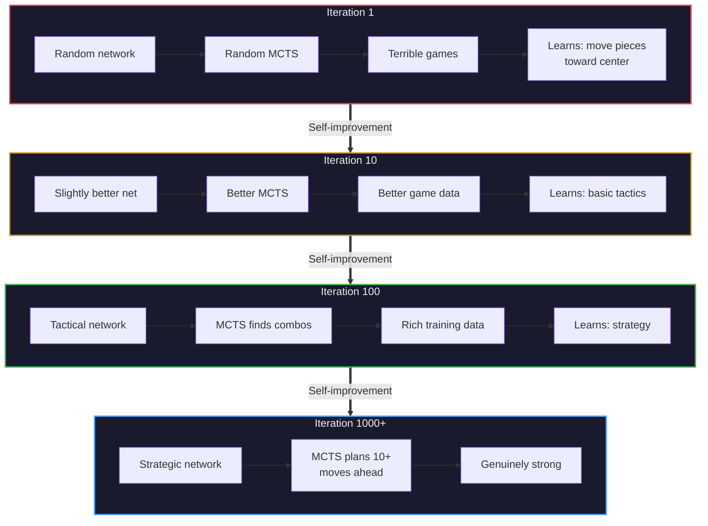

<div align="center">

# AlphaZ0 — Neural Chess Engine

**A from-scratch chess engine powered by AlphaZero-style deep reinforcement learning**

[](https://python.org)
[](https://pytorch.org)
[](https://pygame.org)
[](LICENSE)
[](https://alphaz0.onrender.com)

<br/>

*Monte Carlo Tree Search · A3C Reinforcement Learning · Self-Play Training Pipeline*

*No hardcoded openings. No Stockfish. No human game databases.*

<br/>

[**Play Online →**](https://alphaz0.onrender.com) · [Architecture](#architecture-deep-dive) · [Training Guide](#how-training-makes-the-bot-stronger) · [Get Started](#running-the-project)

---

</div>

> [!NOTE]
> The web version currently plays at roughly **~100 Elo** (chess.com scale) — an early checkpoint, well below the engine's ceiling. Strength scales directly with training compute: see [How Training Makes the Bot Stronger](#how-training-makes-the-bot-stronger) for how Elo climbs as policy loss drops.

<br/>

## Table of Contents

<details>
<summary><b>Click to expand</b></summary>

1. [What Is This?](#what-is-this)
2. [Live Demo](#live-demo)
3. [System Architecture — The Big Picture](#system-architecture--the-big-picture)
4. [Architecture Deep Dive](#architecture-deep-dive)
5. [File-by-File Breakdown](#file-by-file-breakdown)
6. [How Training Makes the Bot Stronger](#how-training-makes-the-bot-stronger)
7. [Training Logs — What They Tell You](#training-logs--what-they-tell-you)
8. [Running the Project](#running-the-project)
9. [Project Structure](#project-structure)
10. [Dependencies](#dependencies)

</details>

---

## What Is This?

AlphaZ0 is a **self-learning chess bot** inspired by [DeepMind's AlphaZero](https://deepmind.google/research/breakthroughs/alphazero/). It learns to play chess purely by playing against itself — starting with nothing but the rules of chess and improving through every training cycle.

The bot has **three brain layers** working together:

```
Rules (chesseng.py)  →  Search (mcts.py)  →  Intuition (NeuralNet.py)
        ↑                                              ↓
        └────────── Training (Train.py) teaches this ──┘
```

<br/>

### Key Features

| Feature | Description |
|:---|:---|
| **Zero Human Knowledge** | Learns entirely from self-play — no opening books, no endgame tables |
| **MCTS with PUCT** | Monte Carlo Tree Search guided by neural network priors |
| **A3C Training** | Asynchronous Advantage Actor-Critic for accelerated parallel learning |
| **Desktop GUI** | Full Pygame interface with board flip, move log, undo support |
| **Web Interface** | Browser-based play via chess.js + chessboard.js — no install needed |
| **Training Pipeline** | Complete self-play → train → evaluate loop with checkpoint management |

---

## Live Demo

<div align="center">

### **[Play AlphaZ0 in your browser →](https://alphaz0.onrender.com)**

</div>

A lightweight browser interface mirroring the desktop experience — built with plain HTML/CSS/JS ([chess.js](https://github.com/jhlywa/chess.js) for rules, [chessboard.js](https://chessboardjs.com/) for the board), deployed as a static site on Render.

| Mode | Description |
|:---|:---|
| **Pass & Play** | Two players share the board locally |
| **vs AlphaZ0** | Play against the bot as either color |

**Interface features:** Click or drag to move · Legal move highlighting · King's square flags red when in check · Promotion picker (Q R B N)

> [!TIP]
> The demo's listed Elo (~100 on chess.com scale) reflects the currently deployed checkpoint — it updates as training progresses. See the [Elo mapping table](#policy-loss-as-strength-indicator) for what different training stages correspond to.

---

## System Architecture — The Big Picture

### End-to-End Data Flow



### The Self-Improvement Loop



### How It Works — Step by Step

<table>
<tr><td width="60"><b>Step</b></td><td><b>What Happens</b></td></tr>
<tr><td align="center">1</td><td><b>Neural Network evaluates positions</b> — Given any board, outputs a <b>policy</b> (move probabilities) and a <b>value</b> (who's winning, -1 to +1)</td></tr>
<tr><td align="center">2</td><td><b>MCTS searches deeper</b> — Runs hundreds of simulated games forward, using the network's policy to guide exploration and value head to prune bad branches</td></tr>
<tr><td align="center">3</td><td><b>Self-play generates data</b> — Two bot copies play each other, recording every <code>(board, MCTS_policy, game_outcome)</code> triple</td></tr>
<tr><td align="center">4</td><td><b>Network learns from its games</b> — Trains to match MCTS's search results (policy) and actual game outcomes (value)</td></tr>
<tr><td align="center">5</td><td><b>A3C workers accelerate learning</b> — Multiple threads run parallel rollouts, pushing gradients to the shared network continuously</td></tr>
<tr><td align="center">6</td><td><b>Repeat</b> — Each cycle produces a slightly smarter bot that plays better games, creating better data, creating a smarter bot…</td></tr>
</table>

---

## Architecture Deep Dive

### Neural Network — `NeuralNet.py`



> **Move encoding:** every possible `(from_square, to_square)` pair maps to a flat index: `row×512 + col×64 + end_row×8 + end_col` → 4096 buckets. Illegal moves get masked out after the network runs.

### MCTS — `mcts.py`



**MCTS Node Fields:**

| Field | Meaning |
|:---:|:---|
| `N` | Visit count — how many times this node was explored |
| `W` | Total accumulated value from all visits |
| `Q` | Mean value = `W / N` — average outcome from this node |
| `P` | Prior probability from the policy head |

**PUCT Selection Formula:**

$$\text{score}(s,a) = Q(s,a) + C_{\text{puct}} \times P(s,a) \times \frac{\sqrt{\sum N}}{1 + N(s,a)}$$

- $C_{\text{puct}} = 1.5$ balances exploitation (high Q) vs exploration (high P, low N)
- **Dirichlet noise** added to root priors ($\alpha=0.3$, $\varepsilon=0.25$) ensures the bot always explores a little, even when confident — critical for diverse training data

### A3C Training — `Train.py`



---

## File-by-File Breakdown

<details>
<summary><b><code>chesseng.py</code></b> — The Rules Engine</summary>

The foundation everything else sits on. **Zero dependencies** on the neural network — pure chess logic only.

| Component | Purpose |
|:---|:---|
| `CastleRights` | Tracks which sides can still castle, logged every move so undo works perfectly |
| `GameState.make_move()` | Applies a move — handles en passant, castling, promotion, rights updates |
| `GameState.undo_move()` | Fully reverses a move including all special cases |
| `GameState.get_valid_moves()` | Generates all pseudo-legal moves, filters any that leave the king in check |
| `GameState.in_check()` | Temporarily switches sides and asks if opponent moves hit the king |
| `GameState.get_status()` | Returns checkmate, stalemate, or ongoing |
| `Move` | Immutable value object with `__eq__` and `__hash__` — works as dict keys in MCTS |

</details>

<details>
<summary><b><code>BoardEncoder.py</code></b> — Board to Tensor</summary>

Converts a `GameState` into an `(18, 8, 8)` float32 numpy array. Each plane is a binary grid where `1.0` means the condition is true at that square. The side-to-move plane means the same network handles both colors without needing two separate models.

</details>

<details>
<summary><b><code>NeuralNet.py</code></b> — The Brain</summary>

| Component | Purpose |
|:---|:---|
| `ResBlock` | Two convolutions with BatchNorm and ReLU plus a skip connection. BatchNorm stabilizes training when game outcomes vary wildly in early self-play |
| `ChessNet` | Stem → residual trunk → policy head + value head. The `.float()` cast before FC layers prevents dtype issues on GPUs running mixed precision |
| `get_policy_priors()` | Masks the 4096-vector to only legal moves, renormalizes, handles the edge case where all priors collapse to zero |

</details>

<details>
<summary><b><code>mcts.py</code></b> — The Search</summary>

| Component | Purpose |
|:---|:---|
| `MCTSNode` | Uses `__slots__` for memory efficiency since thousands of nodes are created per move |
| `MCTS.get_move_probs()` | Runs N simulations of select → expand → evaluate → backup, builds final policy from visit counts |
| Temperature | `τ=1.0` during training (keeps exploration), `τ≈0` during play (effectively greedy) |
| `_copy_state()` | Deep copies game state for each simulation so MCTS branches don't interfere |

</details>

<details>
<summary><b><code>Train.py</code></b> — The Learning Loop</summary>

| Component | Purpose |
|:---|:---|
| `TrainConfig` | Dataclass holding every hyperparameter — change settings here |
| `ReplayBuffer` | Thread-safe deque, old experiences evicted when full, random sampling breaks temporal correlations |
| `Experience` | One training sample: board tensor, MCTS policy distribution, game outcome z |
| `play_one_game()` | Plays a complete game, assigns outcomes by propagating the result back through the trajectory |
| `A3CWorker` | Background thread: clones weights → runs rollout → computes GAE advantages → pushes gradients |
| `train_on_batch()` | One supervised step: policy cross-entropy + value MSE + entropy regularization |

</details>

<details>
<summary><b><code>chesmain.py</code></b> — The Desktop UI</summary>

- Menu screen with Pass & Play vs AlphaZ0 options, color picker for bot mode
- Board flips automatically when playing as Black
- Bot thinks in a background thread so UI never freezes
- Move log sidebar with SAN notation, scrollable with mouse wheel
- Loads `checkpoints/chess_net_best.pt` automatically, falls back to random moves if missing
- **Controls:** `Z` = undo (2 plies in bot mode) · `R`/`Esc` = return to menu

</details>

<details>
<summary><b><code>FE.html</code></b> — The Web UI</summary>

A single-file browser interface mirroring `chesmain.py`'s modes. Deployed at [alphaz0.onrender.com](https://alphaz0.onrender.com). Uses chess.js for move legality and chessboard.js for rendering; click or drag to move, with legal-move highlighting, check detection, and a promotion picker (Queen/Rook/Bishop/Knight).

</details>

---

## How Training Makes the Bot Stronger

### The Improvement Cycle



### Policy Loss as Strength Indicator

| Policy Loss | Meaning | Approx. Elo (chess.com) |
|:---:|:---|:---:|
| **~8.3** | Completely random (log of 4096 possible moves) | < 100 |
| **~6.0** | Learned basic move preferences | ~100–300 |
| **~4.0** | Decent tactical awareness | ~600–900 |
| **~2.0** | Strong play | ~1400–1700 |
| **~0.5** | Near master level | 2000+ |

> [!NOTE]
> The live demo's current checkpoint sits around policy loss **6.3** (~100 Elo chess.com scale) — above random, with MCTS doing most of the heavy lifting. Every 100 additional training iterations moves this lower.

> [!IMPORTANT]
> These Elo mappings are approximate — derived from typical policy-loss-to-strength correlations in AlphaZero-style engines, not from head-to-head rated games against chess.com opponents. Treat them as a rough guide to relative strength.

### What Each Loss Component Teaches

| Loss | What It Teaches | Why It Matters |
|:---|:---|:---|
| **Policy loss** | Which moves are good | As it drops, the network's first guess is closer to MCTS — fewer simulations needed |
| **Value loss** | Who is winning | Good value head means MCTS can cut off unpromising branches early → positional understanding |
| **Entropy bonus** | Explore different ideas | Prevents policy collapse onto 2-3 moves; diverse games = richer training data |
| **A3C actor loss** | Continuous gradient flow | Helps the value head improve faster between main training iterations |

### Recommended Training Progression

```bash
# Phase 1 — Bootstrap (overnight run)
# Goal: get policy loss below 5.0
python Train.py --games 15 --sims 50 --iters 100 --workers 2

# Phase 2 — Strengthen (weekend run)  
# Goal: get policy loss below 3.5
python Train.py --games 25 --sims 100 --iters 300 --workers 4 \
    --resume checkpoints/chess_net_best.pt

# Phase 3 — Polish (long run)
# Goal: genuinely challenging opponent
python Train.py --games 50 --sims 200 --iters 1000 --workers 4 \
    --resume checkpoints/chess_net_best.pt
```

| Parameter | Effect | Recommendation |
|:---|:---|:---|
| `--games` | More games = richer buffer = better training | At least 15 per iteration |
| `--sims` | More MCTS sims = better move quality = better targets | 50–200 depending on speed |
| `--iters` | More iterations = more improvement cycles | As many as you can run |
| `--workers` | More A3C threads = faster value head training | Match your CPU core count |

---

## Training Logs — What They Tell You

```
policy_loss = 6.30   ← network move guesses (lower = smarter)
value_loss  = 0.004  ← position evaluation accuracy (lower = better)
entropy     = 7.5    ← move diversity (too low = collapse, too high = random)
actor_loss  = 0.009  ← A3C policy gradient signal
critic_loss = 0.000  ← A3C value baseline (needs terminal states to learn)
buffer_size = 8590   ← total stored positions (more = better batches)
lr          = 0.0005 ← learning rate (cosine decay over time)
elapsed     = 342s   ← time per iteration
```

### Warning Signs

> [!WARNING]
> | Symptom | Cause | Fix |
> |:---|:---|:---|
> | `value_loss` stuck at `0.000` | Games not reaching checkmate | Increase `--games` or `--max-moves` |
> | `policy_loss` rising after iter 10 | Buffer evicting good data | Increase `--buffer-size` |
> | `entropy` below `3.0` | Policy collapsed | Add more Dirichlet noise or reduce training epochs |
> | `actor_loss` in the millions at iter 1 | Normal A3C warmup instability | Self-corrects — no action needed |

---

## Running the Project

### Quick Start

```bash
# Clone and install
git clone https://github.com/YOUR_USERNAME/AlphaZ0.git
cd AlphaZ0
pip install pygame torch numpy

# Play the game (desktop UI)
python chesmain.py

# Or open FE.html in a browser — no install needed
# Or visit: https://alphaz0.onrender.com
```

### Training

```bash
# Quick test training (~30 min)
python Train.py --games 5 --sims 30 --iters 20

# Serious overnight training
python Train.py --games 15 --sims 80 --iters 200 --workers 2

# Resume from checkpoint
python Train.py --resume checkpoints/chess_net_best.pt --iters 300

# Evaluate the bot
python Train.py --mode eval --eval-model checkpoints/chess_net_best.pt --eval-games 20
```

---

## Project Structure

```
AlphaZ0/
├── chesmain.py              ← Pygame desktop UI, menu, bot integration
├── FE.html                  ← Browser UI (deployed at alphaz0.onrender.com)
├── chesseng.py              ← Chess rules, move generation, game state
├── NeuralNet.py             ← Neural network (policy + value heads)
├── mcts.py                  ← Monte Carlo Tree Search with PUCT
├── BoardEncoder.py          ← Board → (18,8,8) tensor conversion
├── Train.py                 ← Self-play + A3C training pipeline
├── checkpoints/
│   ├── chess_net_best.pt       ← Best model (loaded by UI)
│   ├── chess_net_final.pt      ← Last model after training
│   └── chess_net_iter_XXXX.pt  ← Per-iteration snapshots
└── Image/
    ├── wP.png  wR.png  wN.png  wB.png  wQ.png  wK.png
    └── bP.png  bR.png  bN.png  bB.png  bQ.png  bK.png
```

---

## Dependencies

```bash
pip install pygame torch numpy
```

| Package | Version | Purpose |
|:---|:---:|:---|
| `pygame` | 2.6+ | Desktop UI rendering and input handling |
| `torch` | 2.0+ | Neural network, GPU acceleration, autograd |
| `numpy` | 1.24+ | Board encoding, MCTS policy arrays, tensor ops |

> [!TIP]
> **GPU is optional** but recommended for training. The bot runs fine on CPU for playing.
>
> The web UI (`FE.html`) has **no Python dependencies** — it runs entirely in the browser via CDN-hosted chess.js and chessboard.js.

---

<div align="center">

### Built from Scratch

*Engine · Network · Search · Training Loop · UI*

**No chess libraries. No pretrained weights. No external datasets.**

<br/>

Star this repo if you found it interesting!

---

*Made by [Your Name](https://github.com/YOUR_USERNAME)*

</div>
